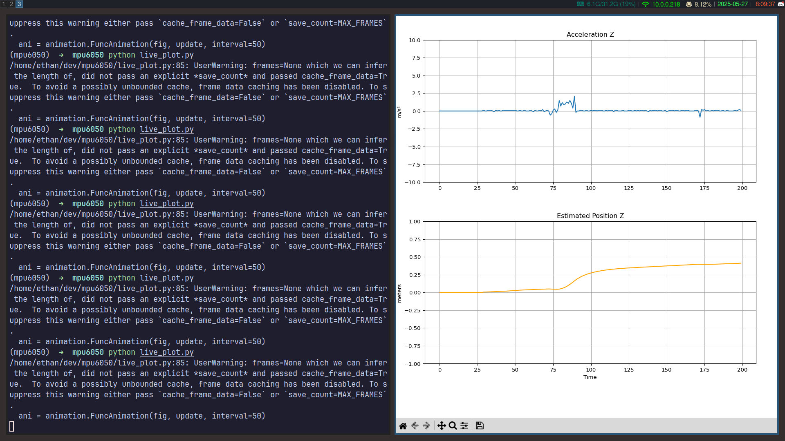

# stm32-mpu-visualization

This project reads acceleration data from an **MPU6050** sensor connected to an STM32 microcontroller and streams it over serial to a Python script running on a PC. The Python program parses the live sensor data, removes gravitational bias, and visualizes the estimated vertical position over time using Matplotlib. This setup provides a real-time view of the device’s tilt or motion along the Z-axis. It serves as a foundation for projects involving IMU data visualization, basic inertial navigation, or embedded sensor data processing.

